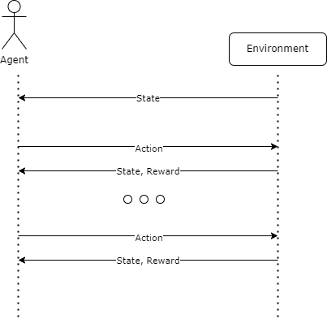
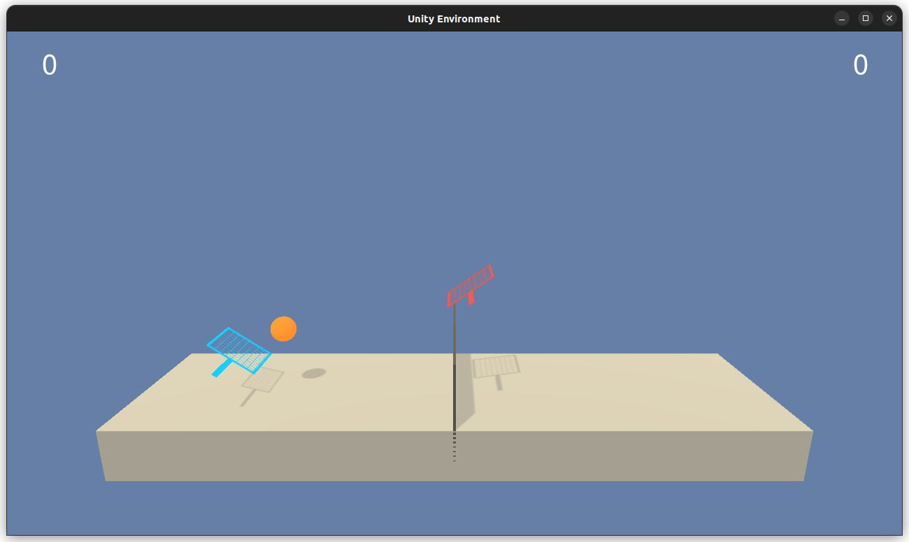

# Playing Tennis
## Multi-Agent Reinforcement Learning

Multi-Agent reinforcement learning is a big area currently under research within
artificial intelligence. Within Reinforcement Learning, the core idea is to 
have an agent that interacts with an environment via some actions and gets
a reward and state signal. As depicted in the following diagram:



One of the key assumptions behind this scenario is that the agent relies on
the environment to be stable or *stationary*. This means that, while the
agent is learning, the rules or dynamics of the environment shouldn't change
with time. This assumption allows for the proof of convergence in many of the
used algorithms nowadays. 

In Multi-Agent reinforcement learning several agents interact with the 
environment at the same time. So, from the perspective of a single agent,
the other agents become part of the environment. And because each of the 
agents is learning a policy they become a moving part that the rest have to
account for. This makes it hard for current algorithms that rely on the
*non-stationary* principle of the environment.

This is the nature of the problem that is tackled within this project.

## Environment

The environment consists of two agents taking control of rackets to
bounce a ball over a net. Each agent is presented with local observations
regarding the racket, and position and velocity of the ball. 



* **Observation space**: an 8 dimensional vector, per agent
* **Action space**: a 4 dimensional vector, per agent
* **Reward**: +0.1 each time an agent hits the ball over the net, -0.01
each time the ball hits the ground or is out of bounds.

Each time step the agent must choose an action in a 4 dimensional
space within the range [-1.0, 1.0]. 

The score of an episode is taken as the maximum over the two agents. And
the environment is considered **solved when the score is at least +0.5 on
average over 100 episodes**.

## How to run the agent

To run and train the agent that solves the environment a `conda` installation is recommended. 
Installing the dependencies requires the following command:

``` sh
conda env create -f environment.yml
```

This will create a new conda environment named `drlnd` and automatically install
all the required packages within it. Then, run the following commands to activate
the environment and open the Jupyter interface:

```sh
conda activate drlnd
jupyter notebook
```

If a web browser window is not automatically open the output of the 
command should show a URL
that can be copied and pasted in a web browser. On this interface
select `Tennis.ipynb` to see the results.

Here you can watch the video of the best agent:

[](https://youtu.be/b13kscuRHq4)

## Training the agent

The agent is trained with the help of the `Weights & Biases` interface. For such it uses
the `config-defaults.yaml` file to store the training parameters. To run a training
session just run the following:

``` sh
wandb off
python train.py
```

This will disable synchronization to the server and do a single training session.
