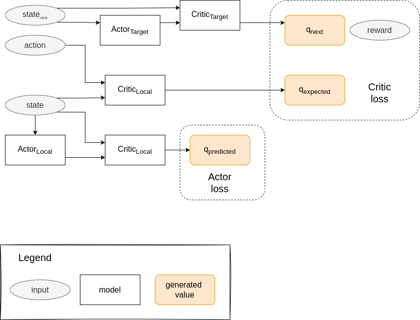
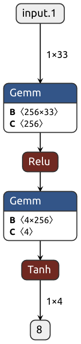
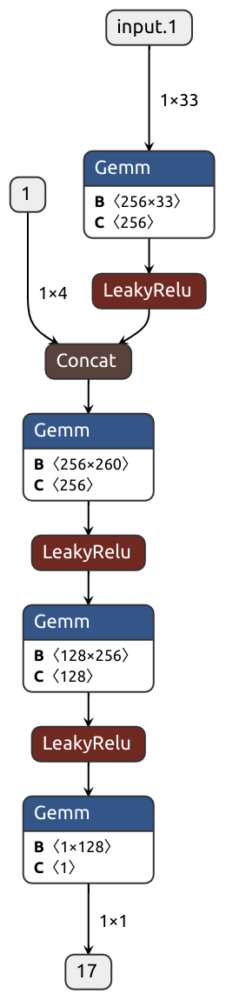
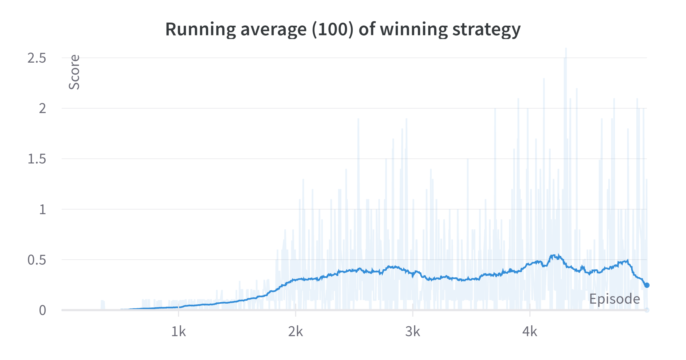

# Solving the Tennis Environment

By: Jorge L. Martínez

## Learning algorithm

DDPG (Deep Deterministic Policy Gradient) is an actor-critic deep reinforcement
learning algorithm that has proven to be very efficient at solving environments
with a continuous state space and a continuous action space. Nonetheless,
in this project the additional challenge is that the scenario consists
of multiple agents learning at the same time. From a single agent perspective,
this violates the *non-stationarity* of the environment assumption, breaking
the convergence proofs of the algorithms and making learning unstable.

In order to solve the environment proposed in [this project](README.md),
several strategies were evaluated, but all relied on the same basic principle
behind DDPG. The algorithm is discussed in the paper [Continuous Control with Deep Reinforcement Learning](https://arxiv.org/abs/1509.02971v6),
and was implemented using the resources from Udacity's Deep Reinforcement
Learning nanodegree and [Shangtong Zang's DeepRL](https://github.com/ShangtongZhang/DeepRL) 
repository.

## DDPG Explained

The main idea of the algorithm is summarized in the following diagram:

Starting with the loss, there are two losses that are approximated: 
critic loss and actor loss.

The critic loss is calculated as:

$$ L = \frac{1}{N} \sum_i \left( y_i - Q(s_i,a_i) \right)^2$$

$$ y_i = r_i + \gamma Q' \left(s_{i+1}, \mu'(s_{i+1})  \right) $$

And the actor loss is approximated as:

$$ J \approx \frac{1}{N} \sum_i \nabla_a Q(s,a) \nabla_{\Theta^\mu} \mu (s) $$

This resembles a lot how Q-Learning works except that the action
from the actor network is assumed to be "the best", as getting the
$ argmax $ over a continuous space is harder. The critic helps drive
the maximization of the actor by estimating the actual Q-value of the
interactions.

At each time step the target actor is used to get the next step. Random
noise is added to this value to allow for exploration. The 
experience is saved in a replay buffer.

Every fixed amount of steps (given by the *learn_every* hyperparameter) the 
agent does a learning step. In this learning step a set of experience
is randomly sampled from the learning buffer and sent through the 
networks as depicted in the diagram above. The local networks' loss
is calculated and a learning step is performed. Finally, the
target networks are updated using a soft-update parameter.

### Replay buffer

Just as in DQN, a replay buffer is used to limit the correlation
between consecutive steps. Each time the agent performs a learning
step it takes a random sample from the replay buffer and uses that 
information.

### Soft update

Also, like in DQN, the target network is slowly updated with the local
network (for both the actor and the critic). This is controlled by the
hyperparameter $ \tau $, and allows to create a soft update according
to the formula:

$$ target = \tau local + (1-\tau)target $$

### Networks

The actor network has as input a state and as output an action. The 
used network was:

The critic network has as input a state and an action, and returs
a single value that represents the Q-value. The used network
was:

## Strategies for Multi-Agent learning

Using DDPG as a starting point, the following strategies were tested:

| Name | Description |
| - | - |
| RandomAgent | Used as baseline. This agent would perform a random action on each time step.|
| NaiveDDPG | An independend DDPG Agent would be used for each paddle. |
| SharedReplay | Two independent DDPG agents that add replay information to the same buffer. |
| SharedCritic | Two independend DDPG agents that share and train the same critic neural network. |
| MADDPGAgent | Two independend DDPG agents that train the critic using information about the states of all agents, but were te actor uses only local state information. Implemented according to this [paper](https://arxiv.org/abs/1706.02275). |
| SingleDDPG | Using a single DDPG agent that uses the whole global state space and returns an action for both agents (as if the paddles were two hands of the same agent). |
| SingleAgent | Single DDPG agent that responds independently as both paddles. |
| PriorityAgent | Two DDPG agents that use a priority replay buffer when sampling for the learning step. |
| PriorityAgent_SharedCritic | Same as PriorityAgent but the agents train the same Critic network. |
| PriorityAgent_SharedActor | Same as PriorityAgent but the agents train the same Actor network. |
| DobleUber | Single DDPG agent that uses a priority replay buffer and responds with actions for both agents. This code was adapted from [Wbert Adrián Castro Vera's repository](https://github.com/dobleuber/DeepReinforcementLearningUdacity). |

During training I had a hard time working with the different strategies
as none of them would seem to get better results. This can be seen in
the following graph:

The winning strategy was adapted from [Wbert Adrián Castro Vera's repository](https://github.com/dobleuber/DeepReinforcementLearningUdacity)
and was the only strategy that managed to get consistent improving 
results. 

## Training

Training was performed using the Unity ML environment for Tennis. 

The hyperparameters that can be tweaked are:
- \# of episodes to train for
- agent : Agent (strategy) to use.
- $ \gamma $ : discount factor
- $ \alpha $ : learning rate
- $ \tau $ : Weight softening when copying between target and local networks
- batch_size : How big a sample to take from the memory buffer
- buffer_size : Memory buffer size
- learn_every : How many steps to wait before doing a learning step

After around 4200 episodes the winning strategy managed to get +0.5
as score. Afterwards the score went down and plummeted at around 
4800 steps.

This used the following hyperparameter settings:

| Hyperparameter | Value |
| - | - |
| algorithm | DobleUber |
| $ \gamma $ | 0.99 |
| $ \alpha $ | 0.0001 |
| $ \tau $ | 0.001 |
| batch_size | 128 |
| buffer_size | 100000 |
| learn_every | 1 |

## Ideas for future work

Several strategies for multi-agent reinforcement learning are discussed
in the paper [Multi-Agent deep reinfocrement learning: a survey](https://link.springer.com/article/10.1007/s10462-021-09996-w). 

While several ideas are discussed regarding how to improve experience
replay, centralized learning and meta-learning; I'm particularly
intrigued by communication methods. In these, the idea is to have
the agents have a communication channel were they can provide 
additional input of the state to the rest of the agents.
This can help with the non-stationarity issue of the environment
as the observation is enriched by each agents' messages. This is 
a very intriguing idea and might be overkill for the current 
scenario, as the agents not only need to learn from each other but
also have to be able to coordinate a common language.

